# B0: backend extraction contract

**Date:** 2026-10-01. **Status:** extraction decisions established; later feature contracts remain scheduled for their implementation phases.

This amendment takes precedence over the Next.js hosting and invitation-only decisions in [API phase 1](api-phase-1-contract.md). It implements the direction confirmed during review of the [backend plan](backend-implementation-plan.md).

## Ownership and deployment boundary

- The API runs as a separate Node.js/Express 5 service on Render. Next.js owns rendering and a same-origin `/api` proxy.
- The API alone owns Supabase credentials, JWT verification, CSRF bindings, sessions, database writes, and authorization. Supabase remains the identity issuer and PostgreSQL host.
- Browser URLs, envelope/error conventions, cookies, session lifetimes, and the five existing auth endpoint payloads remain unchanged.
- Every upstream request except `GET /api/health/live` requires `X-GetHired-Gateway`. The frontend strips all browser-supplied internal/forwarded headers and supplies its configured secret. This is a transport credential, never a user identity.
- The frontend forwards the original browser Origin/CSRF/cookies and every upstream Set-Cookie separately. It never follows upstream redirects or retries mutations automatically.
- The frontend ingress must overwrite one single-IP header. The proxy validates that IP and forwards it as `X-GetHired-Client-IP`. Production ingress selection and deployment verification occur in B2. Do not configure an arbitrary caller-controlled header as trusted.
- Production upstream transport uses HTTPS, or explicitly enabled private HTTP in a trusted network. The frontend hosting vendor remains open; the application requires a Node-capable host for its proxy.
- Only the new API owns auth after cutover. The concrete Next.js auth routes have been removed so they cannot shadow the proxy.

Public wire types live in `packages/contracts`; private provider/session/store types stay in `apps/api`. The [B1 OpenAPI document](backend-b1-openapi.json) describes the implemented browser-facing auth surface and live probe. Business route contracts remain in the backend plan/phase 1 until their schemas are implemented.

## Preserved permission matrix

| Operation | Student | Administrator |
| --- | --- | --- |
| Current user/session | Own | Own |
| Active companies/categories | Read | Read |
| Company/image changes | Deny | `companies:write` |
| Student registry/invitations | Deny | `students:manage` |
| Category/question changes | Deny | `questions:write` |
| Bookmarks | `bookmarks:manage-own` | Deny |
| Interview attempts/answers | Own only | Deny |

Business permission mapping and ownership enforcement are B3+ work. B1 preserves the previous behavior: a route that declares a permission fails closed until a permission implementation exists. Authenticated `me` still uses the current account/session/provider state.

## Confirmed registration contract for B5

Student self-registration supplements administrator invitations. Verification of an eight-digit `@usc.edu.ph` email activates a complete pending student account without administrator approval. The server derives the student number from the normalized email and fixes the role to student. Signup must collect first name, last name, course, year level, email, and password before verification.

| Endpoint | Input | Success data |
| --- | --- | --- |
| `POST /api/auth/signup` | `{ firstName, lastName, email, course, yearLevel, password }` | `202 { message, challengeId }` |
| `POST /api/auth/signup/resend` | `{ challengeId }` | `202 { message, challengeId }` |
| `POST /api/auth/signup/verify` | `{ challengeId, code }` | `200 { accountReady: true, status: "active" }`, then fresh login |

These endpoints are planned, not implemented in B1. Missing/invalid/expired signup proof uses the planned `400 INVALID_VERIFICATION_CODE`; challenge state never reveals account existence before ownership proof. Existing/unknown signup requests use the same public response shape.

```mermaid
stateDiagram-v2
    [*] --> Pending: Eligible signup or administrator registry entry
    Pending --> Pending: Retry or replace expired challenge
    Pending --> Active: Verified email + mapped provider identity + complete profile
    Active --> Inactive: Administrator deactivation and session revocation
    Inactive --> Active: Administrator reactivation; fresh login required
```

Challenges are purpose-bound and browser-bound, expire, have limited verification attempts, and are consumed once. Resend supersedes the previous challenge. Invalid proof cannot mutate another student's profile. Signup cannot overwrite or reactivate existing accounts. Invitation and signup races converge on one unique email/student number mapping; an invitation proof also verifies ownership. Protect temporary reservations from permanent student-number squatting through expiry and verified claiming rules.

The planned database amendment allows `accounts.auth_user_id` to be null only for an unprovisioned pending student. Active accounts/admins require a mapped provider identity. B5 will add account checks, narrowly scoped write privileges, challenge/recovery state, and durable onboarding operations in a new migration. No schema mutation is part of B1.

## Later decisions

The first milestone is authentication plus companies/bookmarks (B1–B4). Signup/recovery/registry delivery is B5. Interview scoring is explicitly unresolved until B7: rubric guidance without numeric scores is the draft recommendation; AI evaluation has not been selected or connected. Frontend hosting, production ingress, availability budget, and live Supabase setup are B2 deployment inputs.
