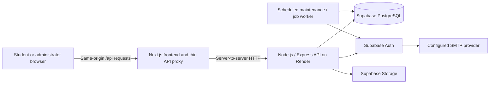

# GetHired backend implementation plan

**Date:** 2026-10-01  
**Status:** B0 extraction decisions established and B1 implemented locally. B2 repository foundation is implemented; hosted setup and acceptance remain pending. See the [B0 contract amendment](backend-b0-contract.md), [B1 implementation/setup](backend-b1-extraction.md), and [B2 staging setup](backend-b2-staging.md). B3–B8 remain pending; later feature choices remain open for review.
**Confirmed for this plan:** a separate Node.js API deployed to Render, retaining Supabase PostgreSQL and Supabase Auth, with student self-registration as well as administrator invitations. Students activate after verifying an eight-digit student ID email at `@usc.edu.ph`; administrator approval is not required.

This extends the [middleware implementation plan](api-middleware-implementation-plan.md). Backend phases below use **B0–B8** so they cannot be confused with middleware phases 1–7. The completed middleware work is the starting point; moving it requires adaptation and verification, not rebuilding authentication from scratch.

## 1. What exists and what changes

| Area | Actual repository state | Treatment in this plan |
| --- | --- | --- |
| Middleware phase 1 | [Agreed contracts](api-phase-1-contract.md), including Supabase, invitation-only access, and Next.js API hosting | Retain resource/session/privacy contracts; revise hosting and signup decisions as confirmed above |
| Middleware phase 2 | Request wrapper, JSON responses/errors, request IDs, limits, logs, configuration | Port behavior into the standalone HTTP service |
| Middleware phase 3 | Five auth routes, Supabase adapter, JWT verification, cookies/CSRF, persistent sessions, shared login counters | Move into Node.js, retaining Supabase as identity issuer |
| Database | [Auth migration](../supabase/migrations/202609290001_phase3_auth.sql) exists; hosted setup was deferred | Verify and apply to development Supabase; add incremental migrations |
| Frontend | Mock state, simulated login/signup/recovery, local-storage role, random interview scores | Replace incrementally with API calls and server-verified page access |
| Business API | Company/student/category/question/bookmark/interview routes are absent | Implement through B3–B7 |
| Remaining middleware | Authorization, general schemas, feature audit coverage, integration | Build alongside each feature; complete release checks in B8 |

Existing auth endpoints have implementation and local test evidence, **not live Supabase/Render verification**. `AUTH_ENABLED=false` currently fails closed with `503`; it does not enable demo authentication.

Two previously agreed decisions are superseded: the API will execute in a separate service, and public student registration will be supported. Prior session limits, student privacy, administrator invitations, and deactivation remain in effect. Historical phase documents describe the earlier implementation; this document records the new direction.

## 2. Proposed architecture

Use **Node.js + TypeScript + Express 5**, existing `pg` database access and `jose` verification, and runtime schemas such as Zod. Express is a proposed HTTP framework choice; Node.js/Render/Supabase are confirmed. Express 5 supports the proposed standalone service structure. [Express documentation](https://expressjs.com/en/guide/migrating-5/)



The frontend renders screens and forwards requests. The API owns identity checks, permissions, validation, business operations, persistence, and audit writes. The frontend has no database credentials or Supabase administrative secret. Shared packages contain only public schemas/types.

### Browser and proxy contract

**Recommendation:** preserve browser URLs under the frontend's `/api`, using a thin Next.js proxy to the separate backend. The API also exposes `/api/...` internally. This preserves the current same-origin cookie model and allows the frontend to be hosted separately. Frontend hosting remains a deployment choice; it must support server execution for the proxy and protected pages.

- Forward the original method, query, body, `Cookie`, `Origin`, `X-CSRF-Token`, content type, and relevant Fetch Metadata headers. Never invent a trusted browser origin for a request with a missing or invalid origin.
- Forward status, response body, request ID, cache policy, and **each** `Set-Cookie` header separately, including cookie deletion. Keep resource `Location` headers frontend-relative.
- Keep `HttpOnly`, `Secure`, `SameSite=Lax`, `Path=/`, no `Domain`, and production `__Host-` cookies. The browser receives cookies from the frontend origin; the upstream API must not add its own domain.
- Fix the upstream URL in server configuration. Prevent arbitrary upstream URLs, path escapes, and redirect following that could forward cookies to another host. Apply deadlines, body limits, and cancellation; sanitize hop-by-hop headers.
- Require a server-only gateway credential on API business/auth requests when the Render API has a public URL. Strip caller-supplied gateway and client-IP headers before adding trusted ones. This credential authenticates the proxy; the backend still validates every user's session and permission.
- Health probes are the only proposed unauthenticated gateway exception, returning minimal status. Browser-public auth routes still pass through the gateway.
- Establish how the frontend ingress supplies a trustworthy client IP. Only then forward one validated IP under a dedicated header authenticated by the gateway. The API's current IP limiter rejects missing or multi-IP values. Do not blindly enable Express `trust proxy` or accept arbitrary `X-Forwarded-For`. [Express proxy guidance](https://expressjs.com/en/guide/behind-proxies/)
- API connection failures become safe JSON `503 SERVICE_UNAVAILABLE` responses with a request ID. Do not automatically replay mutations after timeouts; the upstream may already have committed.

If both services are deployed in an eligible Render private-network configuration, use internal connectivity and retain gateway authentication. Frontend placement and service eligibility must be checked before selecting that topology. [Render private networking](https://render.com/docs/private-network)

Direct cross-origin browser calls are an alternative requiring a separate cookie/CORS/CSRF and protected-page design. Merely changing the frontend base URL is insufficient. The proxy approach is the baseline for this draft.

### Proposed repository structure

Keep the existing Next.js source at the root and introduce npm workspaces without a large frontend folder move:

```text
src/                         Existing Next.js UI, API proxy, page session helper
apps/api/
  src/app.ts                 Express composition, without listening
  src/server.ts              Startup validation, PORT binding, shutdown
  src/http/                  Request adapter, limits, envelopes, errors, logging
  src/auth/                  Ported JWT/provider/cookies/session services
  src/authorization/         Permissions and shared access helpers
  src/modules/               companies, students, onboarding, interviews, etc.
  src/db/                    Shared pg pool, transactions, migration support
  src/jobs/                  Outbox/cleanup job entry points
  tests/                     Ported API tests and new feature coverage
packages/contracts/          Public DTOs and schemas; no secrets or answer rubrics
supabase/migrations/          Single ordered migration history
docs/                        Contracts, setup, operations, OpenAPI document
```

Use a separate buildable API TypeScript configuration and ESM-compatible imports. The root Next.js config currently includes every TypeScript file: exclude the API project from its compilation and build it independently. Replace Next-specific `server-only` imports inside the standalone package with package boundaries; retain browser import guards where Next.js still needs them. Move startup checks from Next instrumentation to the API entry point.

## 3. Contract conventions to retain

The [phase 1 contract](api-phase-1-contract.md) remains the detailed field/limit reference except for explicitly documented amendments here. Keep `/api` paths during extraction; introduce no simultaneous `/v1` rename.

| Topic | Rule |
| --- | --- |
| Success | `{ data, requestId }`; lists add `meta: { page, pageSize, total }` |
| Statuses | `200` read/update/delete acknowledgment, `201` create, `202` accepted email processing; JSON responses, no `204` |
| Errors | `{ error: { code, message, fieldErrors? }, requestId }`; retain existing status/code mappings |
| Pagination | Page 1, page size 20, maximum 100; validate filters and stable sorting |
| Identity | UUID resource IDs; separate unique eight-digit student number; UTC ISO timestamps |
| Validation | Strict create/update schemas; reject unknown fields and empty PATCH; parameterized SQL |
| Limits | Ordinary JSON at most 64 KiB of actual bytes; multipart gets a separate bounded policy |
| Access | Active student/admin for browsing; administrator permissions for management; student-owned queries for `/me` |
| Privacy | Administrators cannot read student interview answers, feedback, or attempts |
| Revocation | Account deactivation, role changes, and password reset revoke sessions; reactivation requires fresh login |
| Caching | API and private page responses use private/no-store policies |

Retain 15-minute access tokens; ordinary student/admin sessions last at most eight hours with 30-minute idle expiry. Remembered students have 30-day absolute and seven-day idle limits. Remember me is ignored for administrators and defaults off in the integrated login form.

Permissions and ownership are enforced by the API, using current database role/status. Sensitive mutations recheck session/account state within the transaction; middleware checks alone leave a race with deactivation. All secret provider keys stay in the API or restricted worker.

## 4. Endpoint inventory and delivery order

All paths below are relative to `/api`. `Public` means no application login; gateway, CSRF, validation, and abuse controls still apply where relevant. Existing means implemented in Next.js and awaiting migration/live verification. Inputs and response fields not amended here follow the original contract.

### Authentication, registration, and recovery

| Method/path | Access | Request → result | Phase/status |
| --- | --- | --- | --- |
| `GET /auth/csrf` | Public | None → `200 { csrfToken }` and browser binding | B1, existing |
| `POST /auth/login` | Public | `{ identifier, password, rememberMe }` → `200 { user, session }` and cookies | B1–B3, existing |
| `GET /auth/me` | Student/admin | None → `200 { user, session }`, own profile | B1–B3, existing |
| `POST /auth/refresh` | Refresh credential + active session | `{}` → `200 { session }`, rotated cookies | B1–B3, existing |
| `POST /auth/logout` | Current/stale/absent session | `{}` → `200 { loggedOut: true }` | B1–B3, existing |
| `POST /auth/signup` | Public | `{ firstName, lastName, email, course, yearLevel, password }` → `202 { message, challengeId }` | B5, new contract |
| `POST /auth/signup/verify` | Bound signup challenge | `{ challengeId, code }` → `200 { accountReady, status }`; fresh login after activation | B5, new contract |
| `POST /auth/signup/resend` | Bound signup challenge | `{ challengeId }` → `202 { message, challengeId }`; replaces previous challenge | B5, new contract |
| `POST /auth/invitations/accept` | Single-use setup proof | `{ tokenHash, newPassword }` → `200 { accountReady: true }`; fresh login | B5 |
| `POST /auth/password-reset/request` | Public | `{ email }` → generic `202 { message, challengeId }` | B5 |
| `POST /auth/password-reset/verify` | Bound recovery challenge | `{ challengeId, code }` → `200 { verified: true }`, recovery-only cookie | B5 |
| `POST /auth/password-reset/complete` | Recovery-only grant | `{ newPassword }` → `200 { passwordUpdated: true }`, revoke all sessions | B5 |

Confirmed signup policy: normalized `^[0-9]{8}@usc\.edu\.ph$` email, student number derived on the server, email verification, and student role assigned exclusively by the server. Collect the complete required profile during signup so verification can activate the account immediately without administrator approval. The current signup form lacks course/year fields; add them. No self-assigned role/status, automatic administrator creation, or bypass for inactive accounts. Auth responses never expose provider access/refresh tokens, passwords, or verification codes.

Keep responses for existing/unknown addresses indistinguishable before proof of email ownership. Add a neutral `400 INVALID_VERIFICATION_CODE` error for signup proof failures. Public request counters use normalized address and trusted IP, with bounded challenge retries. Proposed defaults follow recovery: ten-minute challenge, five code attempts, 60-second resend cooldown, three sends/address/hour and 20/IP/hour; tune with provider limits.

### Companies and own bookmarks

| Method/path | Access | Request → result | Phase |
| --- | --- | --- | --- |
| `GET /companies` | Student/admin | `q`, `niche`, repeated `specialization`, pagination → active `Company[]` | B4 |
| `GET /companies/{companyId}` | Student/admin | UUID → active `Company`; inactive/missing `404` | B4 |
| `GET /admin/companies` | `companies:write` | Search/filter/status/pagination → all matching `Company[]` | B4 |
| `POST /admin/companies` | `companies:write` | Company create DTO → `201 Company` | B4 |
| `PATCH /admin/companies/{companyId}` | `companies:write` | Partial editable fields/status → `200 Company` | B4 |
| `POST /admin/company-images` | `companies:write` | Multipart `file` → `201 { imageId, url }` | B4 |
| `GET /me/bookmarks` | Student, own | Pagination → visible `Bookmark[]` | B4 |
| `PUT /me/bookmarks/{companyId}` | Student, own | `{}` → `200 Bookmark`, idempotent save | B4 |
| `DELETE /me/bookmarks/{companyId}` | Student, own | No body → `200 { removed: true }`, idempotent | B4 |

Search matches name/industry/location/specialization; filters combine with AND, selected specializations with OR. Persist inactive-company bookmarks but hide their details and exclude them from visible counts. `saved` belongs to the student's view, not the company record. Define niche mapping centrally. The UI currently derives filter options from all mocks: provide a shared fixed taxonomy initially so pagination does not make available filters incomplete.

### Student registry and invitations

| Method/path | Access | Request → result | Phase |
| --- | --- | --- | --- |
| `GET /admin/students` | `students:manage` | `q`, `course`, `status`, pagination → `Student[]` | B5 |
| `POST /admin/students` | `students:manage` | Student academic/contact fields → `201 Student`, pending setup | B5 |
| `PATCH /admin/students/{studentId}` | `students:manage` | Allowed profile fields/status → `200 Student` | B5 |
| `POST /admin/students/{studentId}/invitations` | `students:manage` | `{}` → `202 { message }`, durable send/resend operation | B5 |

Use account UUID as `studentId`; student number stays an editable unique academic identifier subject to policy. Self-registration and invitations converge on the same account/profile. Surface provisioning/delivery status to administrators through a proposed `onboarding` projection in list/create/update responses; an email request's `202` does not promise delivery.

Account removal means deactivation. Never return passwords. Email correction is permitted only before provider provisioning; otherwise retain the existing `409 CONFLICT` restriction until a verified email-change flow is designed. Administrator status updates cannot activate unverified or incomplete pending accounts; successful verified setup controls initial activation.

### Categories and question bank

| Method/path | Access | Request → result | Phase |
| --- | --- | --- | --- |
| `GET /categories` | Student/admin | Pagination → active `Category[]`, derived pipeline | B6 |
| `GET /admin/categories` | `questions:write` | Status/pagination → `Category[]` | B6 |
| `POST /admin/categories` | `questions:write` | Category DTO → `201 Category` | B6 |
| `PATCH /admin/categories/{categoryId}` | `questions:write` | Editable fields/status → `200 Category` | B6 |
| `GET /admin/categories/{categoryId}/questions` | `questions:write` | Status/pagination → `Question[]` with rubrics | B6 |
| `POST /admin/categories/{categoryId}/questions` | `questions:write` | Question DTO → `201 Question` | B6 |
| `PATCH /admin/questions/{questionId}` | `questions:write` | Editable fields/status → `200 Question` | B6 |

Use stable UUIDs, including coding challenges and generated introduction/closing prompts. Students receive assigned question projections through attempts; no student endpoint exposes the whole bank or grading rubrics. Retain category create fields from phase 1 and its derived pipeline; phase configuration is operator-managed initially. A UI for custom pipeline editing is a later contract extension.

### Interview attempts

| Method/path | Access | Request → result | Phase |
| --- | --- | --- | --- |
| `POST /me/interview-attempts` | Student, own | `{ categoryId }` → `201 Attempt` with assigned snapshots | B7 |
| `GET /me/interview-attempts` | Student, own | Category/status/pagination → `AttemptSummary[]` | B7 |
| `GET /me/interview-attempts/{attemptId}` | Student, own | UUID → `200 Attempt` including own saved answers/available feedback | B7 |
| `PUT /me/interview-attempts/{attemptId}/answers/{questionId}` | Student, own | `{ answer }` → `200 AnswerResult` | B7 |
| `POST /me/interview-attempts/{attemptId}/complete` | Student, own | `{}` → `200 AttemptResult`, repeatable acknowledgment | B7 |

`questionId` identifies an assigned snapshot, not an array index. Scope every lookup to the authenticated student. Deny inaccessible IDs with `404`; reject client-supplied owner, score, feedback, rubric, and completion time. Complete only after every assigned question has an answer; results then become immutable. Retrying replaces an answer while in progress; restarting creates a new attempt. Coding answers remain text; code execution is outside this plan.

### Operations

| Method/path | Access | Result | Phase |
| --- | --- | --- | --- |
| `GET /health/live` | Public, minimal | `200 { status: "ok" }` in normal envelope if process can serve | B1 |
| `GET /health/ready` | Public, minimal | `200` when configured/migrated/database-ready; otherwise safe `503` | B2 |

No administrator-creation, password-read, hard-delete, administrator interview-history, or job-application endpoints are needed for the current product. Maintenance jobs run as worker commands, not public mutation endpoints.

## 5. Database and persistence plan

Keep application tables in `gethired_private`, inaccessible to browser Supabase roles/Data API/Realtime. Keep the existing SQL migration history and `pg` repository pattern initially. Introduce a migration ledger and serialized migration runner; apply later changes as new migrations.

| Tables | State/purpose and key constraints |
| --- | --- |
| `accounts`, `student_profiles` | Existing identity/profile mapping; unique normalized email, student number, and provider subject |
| `sessions`, `auth_limits`, `provider_cleanup` | Existing revocation/session/counter/cleanup behavior; retain and verify provider schema dependencies |
| `companies`, `company_images` | Company fields/status; slots 0–100,000; image object key, validated media metadata, attachment state |
| `bookmarks` | Unique `(account_id, company_id)`, timestamp, foreign keys |
| `categories`, `category_phases`, `questions` | Category presentation, ordered phase rules, question text/type/hint/private rubric/status/version |
| `interview_attempts` | Owner, category/pipeline snapshot, status, start/completion times, final evaluation metadata |
| `attempt_questions` | Immutable assigned prompt/hint/private rubric snapshot, source/version, unique order within attempt |
| `attempt_answers` | One current answer per assigned snapshot, revision, submitted time, feedback/evaluation version; enforce matching attempt |
| `onboarding_operations`, `auth_challenges`, `recovery_grants` | Retryable provider mapping, purpose/browser-bound challenges, expiry/attempt counters, single-use setup/reset state |
| `outbox_jobs`, `audit_events` | Durable side effects, retry schedule/deduplication; append-only attributable administrator/security events |

**Required auth-schema amendment:** `accounts.auth_user_id` is currently NOT NULL and references `auth.users`. A registry entry cannot currently exist before provider creation. Proposed migration: permit a null provider ID only for an unprovisioned pending student; retain the unique foreign key when populated, require an ID for active/admin accounts, and reject unmapped accounts throughout authentication. This keeps one stable student/account UUID across invitation and signup. Audit the revocation trigger and all subject assumptions for the new pending state.

Reserve unique email/student number in a transaction; link provider identities only after verified proof and checks against the recorded onboarding operation. Handle races between admin creation, signup, and retries with unique constraints and account locks. An existing or inactive account cannot be overwritten or reactivated by public signup. Expire abandoned public pending reservations under an agreed policy so an unverified request cannot permanently reserve someone else's student number; preserve legitimate administrator registry entries.

Extend runtime privileges deliberately. Existing runtime can read accounts/profiles but cannot update them. Add narrow account/profile functions or column privileges for approved student transitions, with administrator checks in services, immutable role assignment, and revocation/audit in the transaction. Keep migrations, Auth-table cleanup, and general role management outside the ordinary API login.

Index company status/name, category/question status and category ID, student search fields, own bookmarks, attempts by `(account_id, created_at, id)`, and pending job schedules. All lists need stable secondary UUID sorting. Add timestamps and constraints rather than relying only on frontend validation.

Provider HTTP calls cannot participate in a PostgreSQL transaction. Record onboarding/email/reset operations with idempotency keys and retry state; reconcile partial completion after provider failure. Never store plaintext passwords in jobs. Password-bearing provider calls happen synchronously; only safe follow-up work is queued. A reset must not report success until the grant is consumed, provider password update is known, and local revocation commits. Define a retryable partial-reset state that keeps application access denied if the provider succeeds before a local failure.

Use a modest shared `pg` pool with connect/query/lock timeouts and a documented connection budget across instances/workers. Start with direct PostgreSQL when reachable, otherwise Supabase's session pooler with the restricted role. Verify TLS certificates; adapt CA configuration if required rather than disabling verification. [Supabase connection guidance](https://supabase.com/docs/guides/database/connecting-to-postgres)

## 6. Implementation phases

Each phase produces a reviewable increment with acceptance checks. These are future implementation checks, not claims that the feature already works.

### B0 — Finalize contracts and migration boundaries

**Progress:** extraction boundary and registration policy recorded in the [contract amendment](backend-b0-contract.md). The implemented auth surface has an [OpenAPI document](backend-b1-openapi.json). Production hosting inputs and future feature schemas remain scheduled for their dependent phases.

**Depends on:** review of this draft.

- Record confirmed separate-service, Supabase, and self-registration decisions in the contract amendment.
- Record the confirmed signup activation policy and decide proxy/frontend hosting, initial feedback behavior, and launch scope (section 9).
- Specify public DTOs/OpenAPI examples, permission matrix, registration challenge transitions, and schema changes before changing routes.
- Agree that one API service owns sessions and database writes during cutover.

**Done when:** hosting/identity ownership and new signup flows are unambiguous; proposed endpoint changes are documented. Historical completion evidence remains distinguishable from new implementation.

### B1 — Extract the Node.js API and preserve authentication behavior

**Completed locally:** [implementation, setup, and verification](backend-b1-extraction.md). The separate Express service and Next.js proxy now own the respective responsibilities described below.

**Depends on:** B0 architectural choice.

- Add the API workspace, Express bootstrap, Node/TypeScript build, config validation, and graceful HTTP/pool shutdown.
- Port existing auth/provider/store/JWT/cookie logic. Adapt Web `Request`/`Response` and streaming-body handling to Express through a small transport boundary; avoid duplicating session logic.
- Port API envelopes, limits, JSON 404/405, `Allow`, `HEAD`, request IDs, and redacted logs. Map parser errors into the contract instead of Express HTML errors.
- Preserve route-declared access and fail-closed permission behavior until policies are implemented.
- Add the thin frontend proxy and live probe. Switch all five auth routes together; remove concrete Next auth handlers that would otherwise shadow the proxy catch-all. Retire the Next auth runtime/instrumentation after extraction.
- Move/adapt existing tests, including their React `server-only` test condition, to run against plain Node and the proxy.

**Done when:** the API starts independently (local port 4000 proposed), the UI remains on 3000, existing auth/CSRF/error contracts pass through the proxy, multiple cookies survive forwarding, and caller-forged gateway/IP headers are rejected. No hosted database is required for the initial porting tests.

### B2 — Connect development Supabase and deploy a staging foundation

**Depends on:** B1.

- Configure an isolated development/staging Supabase project; verify the migration's use of `auth.users`, `auth.sessions`, and `auth.refresh_tokens` against the hosted schema before applying it.
- Create the restricted API database login and operator-only migration/cleanup credentials. Provision one verified test administrator and student through an operator procedure.
- Configure asymmetric signing keys, 900-second access lifetime, stable cookie secret, exact frontend origin, trusted ingress/IP chain, and connection pooling.
- Deploy the API foundation to Render with readiness checking and private secrets. Verify API/proxy reachability and production cookie behavior.
- Schedule provider cleanup and expired-counter pruning using an operator job; web runtime cannot execute privileged cleanup. Test revocation despite provider outages.

**Done when:** real login → me → refresh → logout works through the deployed frontend proxy; unknown/inactive users fail; deactivation revokes access; multiple connections exercise refresh locking. Schema compatibility and ingress trust have live evidence.

### B3 — Authorization, feature infrastructure, and frontend session integration

**Depends on:** B2.

- Implement centralized student/admin permissions and resource ownership helpers; require explicit permission declarations for business routes.
- Add shared transaction helpers, strict feature validation, append-only audit storage, and outbox primitives before sensitive feature writes.
- Build `src/lib/api-client.ts` for envelope/errors, CSRF bootstrap, bounded retries, and coordinated refresh across tabs. Re-fetch CSRF after login/recovery binding changes.
- Connect login/logout/profile to the API; default Remember me off. Remove local storage as an identity source.
- Protect `/dashboard` and `/admin` using a frontend server helper calling backend `/auth/me` with the request cookies. Server-rendered GET checks must not silently rotate cookies; use the browser refresh flow when needed, then retry navigation. Distinguish backend outage from invalid credentials.
- Preserve no-store rendering; wrong-role users get an access-denied view. Private business endpoints remain protected independently of pages.

**Done when:** changing local storage cannot grant access, role/ownership denials are consistent, refresh works across tabs, and the login/profile/logout UI uses live state. Public signup/recovery controls remain explicitly unavailable until B5 rather than simulating success.

### B4 — Companies, uploads, and bookmarks

**Depends on:** B3.

- Add company/image/bookmark migrations, repositories, schemas, permissions, and transactionally recorded admin changes.
- Implement company browsing/search/filter/pagination and administrator create/edit/status operations.
- Extend the current JSON-only wrapper with a route-specific streaming multipart policy. Keep ordinary JSON limits intact; allow one image file up to 2 MiB with a bounded multipart overhead budget, at most 4,096 pixels per dimension, verified JPEG/PNG/WebP decoding/re-encoding, and metadata removal.
- Store images in Supabase Storage, with writes through the administrator API and public delivery only for nonprivate company images. Associate only existing validated `imageId` values; clean unattached objects using jobs. Update frontend remote-image configuration as needed.
- Implement idempotent bookmark save/remove and own saved-company listing; remove global `saved` persistence.
- Replace administrator company state and student company/bookmark mocks with requests and loading/empty/error states.

**Done when:** an administrator's company update is visible to a student after refetch and survives restart; students cannot mutate companies; bookmarks are private; inactive records and invalid uploads behave as specified.

**First useful product milestone:** live authentication, company management/browsing, and bookmarks on the deployed stack. Onboarding uses controlled test accounts until B5.

### B5 — Student registry, self-registration, invitations, and recovery

**Depends on:** B3; may follow B4 for the first milestone.

- Apply the pending-account migration and add challenge, onboarding, recovery, and durable email operation storage.
- Implement admin registry and invitations together with public signup; use one account mapping and explicit retry/reconciliation rules.
- Configure Supabase email confirmation and the provider signup mode needed by the server adapter. This revises the old disabled-signup setup. A directly created Supabase identity must still have no application access without an eligible, verified application account/profile/session.
- Use the server adapter for signup and OTP verification; no Supabase browser auth client. Select the correct provider proof type for signup, invitation, and recovery independently. Never trust a supplied email or provider user metadata as proof. Supabase documents signup confirmation and OTP verification separately. [Signup](https://supabase.com/docs/reference/javascript/auth-signup), [verification](https://supabase.com/docs/reference/javascript/auth-verifyotp)
- Treat any provider session returned by verification as setup-only: do not issue ordinary application cookies, complete required mapping, terminate temporary provider sessions, and require fresh login. Reconcile already-verified provider state after application write failures using the bound operation.
- Implement signup/resend/verify, invitation acceptance, and the three recovery endpoints with purpose-bound, short-lived, single-use proofs. Encrypt any temporary provider recovery credential server-side; keep its key separate from the cookie secret.
- Configure production-capable SMTP, email templates, redirect allowlists, and delivery retries. Supabase's default SMTP restricts recipients and is not intended for production email delivery. [Supabase SMTP guidance](https://supabase.com/docs/guides/auth/auth-smtp)
- Verify shared OTP expiry settings across confirmation/invitations/recovery before selecting durations; provider email-link expiry settings can affect multiple flows. [Supabase email verification settings](https://supabase.com/docs/guides/auth/auth-email-passwordless)
- Replace simulated signup/OTP/reset and generated/default-password UI; add invitation setup and necessary course/year inputs. Align new-password policy with the contract (proposed 12–128 characters).

**Done when:** a new student can register, verify, and enter only under the selected activation policy; an invited student can set a password; duplicate/racing flows create one profile; inactive users cannot reactivate themselves; reset invalidates other devices. Failed email/provider work remains observable and retryable without passwords in storage or logs.

### B6 — Categories and question bank

**Depends on:** B3; ordinarily after B5.

- Implement category/question CRUD-through-create/update/status endpoints, validation, permissions, and audit records.
- Migrate reviewed content from mocks using UUID mapping; exclude demo people/passwords. Move introduction/fallback/closing prompts and coding challenges out of the browser's authoritative selection path.
- Define phase order, question counts/types, shortage behavior, and the default pipeline for newly created categories. Use explicit configuration instead of category-name/slug checks.
- Resolve the existing `Design Challenge` mock type, which is absent from phase 1's accepted enum: explicitly map it to an agreed supported type or amend the enum before seeding.
- Replace administrator question-bank and student category-list state with API data. Deactivation prevents future selection without destroying historical content.

**Done when:** edits persist, student payloads/bundles contain no private evaluation rubrics, and every selectable category produces a valid server-selected pipeline or a clear unavailable response.

### B7 — Persistent interview practice and agreed feedback

**Depends on:** B6 and a feedback decision.

- Implement attempts, immutable question snapshots, answer revisions, history, and transactional completion. Persist before returning success; reload resumes the attempt.
- Lock the attempt during answer replacement/completion so concurrent writes cannot alter completed results. Ensure a retried save cannot create duplicate answers or evaluations.
- Move phase construction to the backend; the UI renders the returned sequence and status.
- Replace random scores. **Proposed initial release:** rubric-based practice guidance with no numeric score and no claim of AI evaluation. This requires an explicit `score: null` / evaluation-mode contract amendment and corresponding results UI changes before B7 ships.
- If actual AI evaluation is required for launch, specify provider/data retention, minimum submitted data, evaluation rubric/version, expected latency, quotas/cost limits, timeout/retry behavior, and structured output validation first. Treat answer text as untrusted content; feedback cannot authorize actions. Never substitute random scores on provider failure.
- For slow evaluation, extend the contract deliberately: saved answer with pending feedback, revision-keyed job, polling through own-attempt GET, and agreed completion rules. The current synchronous `200 AnswerResult` contract must not silently promise finished evaluation. Discard stale job results after an answer revision.

**Done when:** two students cannot access each other's attempts, answers survive reload, snapshots survive question edits, completion is repeatable and immutable, and feedback behavior matches the chosen release contract. No code runner or administrative attempt access is introduced.

### B8 — Release validation and operations

**Depends on:** phases included in the agreed launch scope; a full-feature launch requires B1–B7.

- Complete cross-feature access, validation, audit, and frontend failure-state coverage. Remove remaining mock authority and misleading AI claims from live flows.
- Run contract/auth tests, type checks and production builds for both projects, proxy/cookie browser checks, real SMTP/invitation/reset flows, direct-API access checks, concurrency checks, and upload abuse cases.
- Check load with representative student usage and set API/DB/job limits from measured capacity. Verify backup/restore, deployment rollback, and provider outage recovery.
- Document log access/retention, account/answer retention and eventual deletion, secret/key rotation, cleanup job ownership, alerts, and a first-admin procedure. Proposed prior retention defaults are 30 days for request/security logs and 365 for audit events, subject to review.
- Roll out to a small pilot group before wider student access. Keep staging separate from production identities/storage/data.

**Done when:** production configuration and migrations are reproducible; operators can diagnose and recover failures; acceptance checks pass on the deployed topology; all enabled user flows use persistent backend state.

## 7. Render deployment plan

Deploy the backend as a **Node web service**. Bind to `0.0.0.0` and Render's `PORT`. Keep it stateless with PostgreSQL/Storage persistence. [Render web services](https://render.com/docs/web-services)

| Setting | Proposed value/work |
| --- | --- |
| Repository root | Repository root, so workspaces/shared contracts and root lockfile are available |
| Build | Proposed workspace scripts: `npm ci && npm run build --workspace @gethired/contracts && npm run build --workspace @gethired/api` |
| Start | Proposed `npm run start --workspace @gethired/api`, ultimately running compiled `dist/server.js` |
| Node version | Pin a supported version tested by both projects in `.node-version`/engines; avoid relying on the platform default |
| Health path | `/api/health/ready`; bounded DB/config/schema probe with minimal public response |
| Region | Choose near the Supabase project and intended users; verify available regions during setup |
| Deploy trigger | Staging on checked changes; production after required CI checks and migration success |
| File storage | Supabase Storage for durable images; no local upload persistence |
| Workers | Separate command/service or scheduled job for email/outbox/cleanup; no in-memory-only queue or timer |

Workspace names/scripts above are implementation deliverables; they do not exist yet. Render supports explicit Node version pinning. [Node version configuration](https://render.com/docs/node-version)

Use a lightweight readiness query with a short deadline and expected schema version; avoid making an external Auth/email call for every health probe. Probe process liveness separately for diagnosis. Render HTTP checks influence routing and deployments. [Health checks](https://render.com/docs/health-checks)

Run migrations once using an isolated operator job with restricted secret access, before rollout. Keep migration credentials out of the long-running API environment. Render supports a pre-deploy stage on eligible paid services, but a dedicated CI migration job better separates privileged credentials in this design. Do not migrate from every process at startup. Use additive migrations compatible with the old and new app while deployments overlap; rolling back application code does not roll back database data. [Render deployment stages](https://render.com/docs/deploys)

Free services can be useful for staging experiments but sleep after idle periods and use ephemeral local files. Select the production service tier and job capacity based on availability needs and budget at deployment time. [Render free-service limitations](https://render.com/docs/free)

### Configuration ownership

| Location | Configuration |
| --- | --- |
| Next.js server | Internal API base URL, gateway credential, frontend origin, trusted ingress IP normalization; no `NEXT_PUBLIC_` secrets |
| Node API | Existing `APP_ORIGIN` (frontend origin), `AUTH_ENABLED`, `SUPABASE_URL`, `SUPABASE_PUBLISHABLE_KEY`, `SUPABASE_JWT_ALGORITHMS`, restricted `DATABASE_URL`, stable `AUTH_COOKIE_SECRET`, `AUTH_TRUSTED_IP_HEADER`, body/log settings |
| New Node config | Gateway credential verification, port, DB timeouts/pool budget, storage bucket, privileged Auth/Storage adapter credentials only when needed, recovery encryption key, job settings |
| Supabase/project | Signing keys, JWT/email verification settings, SMTP, email templates, redirect allowlist, private schema/bucket policies |
| Operator/worker | Migration and narrowly scoped maintenance credentials; delivery/evaluation secrets only for the jobs that need them |

Keep separate secrets per environment. Stable cookie secrets must match across API instances. Startup validates configuration without exposing values. Local development needs an explicit API environment-loading script because standalone Node does not automatically inherit Next.js `.env.local` handling.

## 8. Testing and cutover strategy

Reuse `tests/api-foundation.test.ts`, `tests/auth-phase3.test.ts`, and `tests/auth-http-smoke.mjs` as behavioral baselines. Port their transport assumptions; passing the old Next.js tests alone does not validate the separate service/proxy. Retain embedded PostgreSQL coverage and add real staging integration for managed Auth schema, provider refresh behavior, and concurrency.

| Boundary | Required evidence |
| --- | --- |
| API extraction | Same envelopes/statuses, safe unknown methods/routes, request limits, no HTML parser errors |
| Proxy | All cookies preserved/deleted, CSRF/origin forwarded accurately, gateway spoofing rejected, upload limits and timeouts safe |
| Authentication | Tampered/expired/wrong issuer/audience tokens denied; logout/deactivation/reset invalidate access |
| Authorization | Student cannot manage admin records; owner changes and guessed UUIDs cannot cross account boundaries |
| Database | Unique/race constraints, transaction rollback with audit failure, partial provider operation recovery |
| Features | Company status visibility, private bookmarks, signup/invitation convergence, persistent immutable attempts |
| Operations | Restart retains data, schema/DB outage yields safe failures, cleanup retries work, logs exclude credentials and answers |

Migrate auth ownership in one cutover. Backend availability and proxy forwarding must be established before removing old handlers. Roll back the frontend proxy routing and matching backend release together if needed; do not operate two independent session authorities. Preserve cookie names, origin, secret, and database mapping when possible; deliberately require fresh login if any binding changes.

## 9. Decisions for phased review

| Decision | Current position | Needed before |
| --- | --- | --- |
| Separate Node.js service on Render | Confirmed by user | Established |
| Supabase PostgreSQL and Auth | Confirmed by user | Established |
| Student self-registration plus invitations | Confirmed by user | Established |
| Express + TypeScript and same-origin frontend proxy | Proposed implementation default | B1 |
| Frontend host and trusted ingress/IP source | Vercel confirmed; `x-vercel-forwarded-for` selected, deployed spoofing verification pending | B2 |
| Signup activation | Confirmed: verified eight-digit USC student email activates the account; collect required profile during signup; no administrator approval | Established; implement B5 |
| Feedback | Proposed rubric guidance without numeric scores first; actual AI evaluation is a separate reviewed choice | B7 |
| Launch scope | First milestone B1–B4; full onboarding/practice release B1–B8 | Release planning |
| Budget, expected concurrency, retention | Open; use measured pilot usage and agreed retention before production | B8 |

Review B0/B1 first to settle extraction and proxy behavior. Then review the first deployed company workflow before committing to onboarding and interview implementation details. Every phase includes its own schemas, permissions, failure behavior, frontend wiring, and acceptance criteria.
